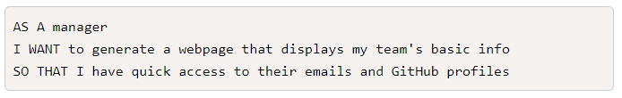
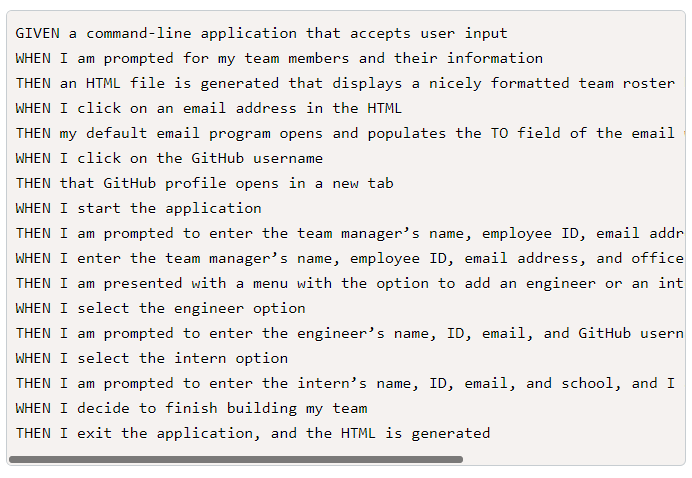
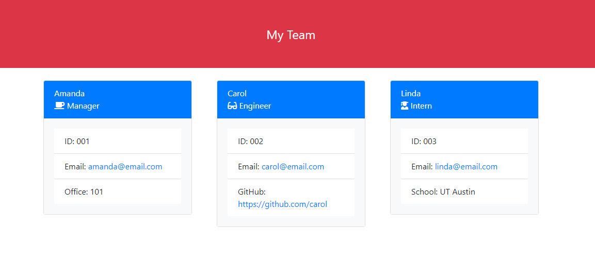

# team-profile-generator

## Table of Contents
- [User Story](#User-Story)
- [Acceptance Criteria](#Acceptance-Criteria)
- [Description](#Description)
- [Video](#Video)
- [Application Screenshot](#Application-Screenshot)

## User Story

## Acceptance Criteria

## Description
This project runs using node and jest. When the application is started, it runs through prompts to ask the user to add an employee. First they are asked for what the employee's role is, then for generic information such as name, id and email, and depending on the role, the application will then ask the user for additional information. 

## Video
[Recording of App Functionality](https://drive.google.com/file/d/1T8RYdNMuyTnprJRemiyEQXWjxh1Yiu36/view)

## Application Screenshot

## Contact
Email: [catse2000@yahoo.com](mailto:catse2000@yahoo.com)
GitHub: [github.com/catse2000](https:github.com/catse2000)
